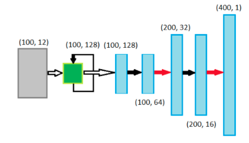
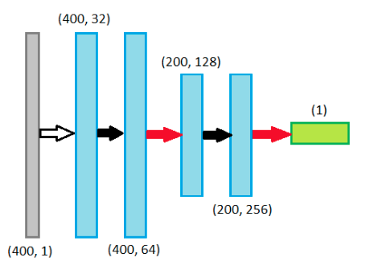
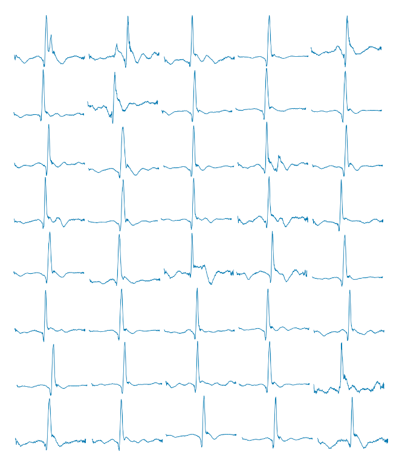

# LSTM-GAN for generate plausible ECG signals

### Dataset

The database consists of 2032 10-second 12-lead ECG signal records representing different morphologies of the ECG signal. 
Signals are digitized at 500 samples per second.
The ECGs were collected from healthy volunteers and patients of the Nizhny Novgorod City Hospital No 5 in 2017–2018.

Noise siglnas were removed from dataset. Each signal was cut into nine-second signals (400 samples).

### Model

Generator has BiLSTM layer with 128 units. LeakyReLU activation on hidden convolutionals layers and Tanh activation on output convolutional layer.
Discriminator has LeakyReLU activation on hidden convolutionals layers. Dense layer with 1 unit as ouput.

### Results

|      | Mean    | Min      | Max     |
| :--: | :-----: | :------: | :-----: |
| RMSE | 0,078   | 0,021    | 0,169   |
| PRD  | 14,82   | 4,55     | 49,19   |
| MMD  | 9*10^-4 | -6*10^-5 | 1*10^-2 |

### Links:

Tensorflow 2 DCGAN tutorial: [Tensorflow.org](https://www.tensorflow.org/beta/tutorials/generative/dcgan.ipynb)

Lobachevsky University Electrocardiography Database: [PhysioNet](https://doi.org/10.13026/qweb-sr17)

V. V. Kuznetsov, V. A. Moskalenko, N. Yu. Zolotykh. Electrocardiogram Generation and Feature Extraction Using a Variational Autoencoder. Institute of Information Technologies, Mathematics and Mechanics Lobachevsky State University of Nizhni Novgorod Nizhni Novgorod, Russia. [arXiv:2002.00254](https://arxiv.org/abs/2002.00254)

T. Golany, K. Radinsky. PGANs: Personalized Generative Adversarial Networks for ECG Synthesis to Improve Patient-Specific Deep ECG Classification. Proceedings of the AAAI Conference on Artificial Intelligence, 33 (2019)

F. Zhu, F. Ye, Y. Fu, Q. Liu, B. Shen, B. Electrocardiogram generation with a bidirectional LSTM-CNN generative adversarial network. Scientific reports, 9 (1), pp. 1–11 (2019)

A. M. Delaney, E. Brophy, T. E. Ward. Synthesis of Realistic ECG using Generative Adversarial Networks. [arXiv:1909.09150](https://arxiv.org/abs/1909.09150)
